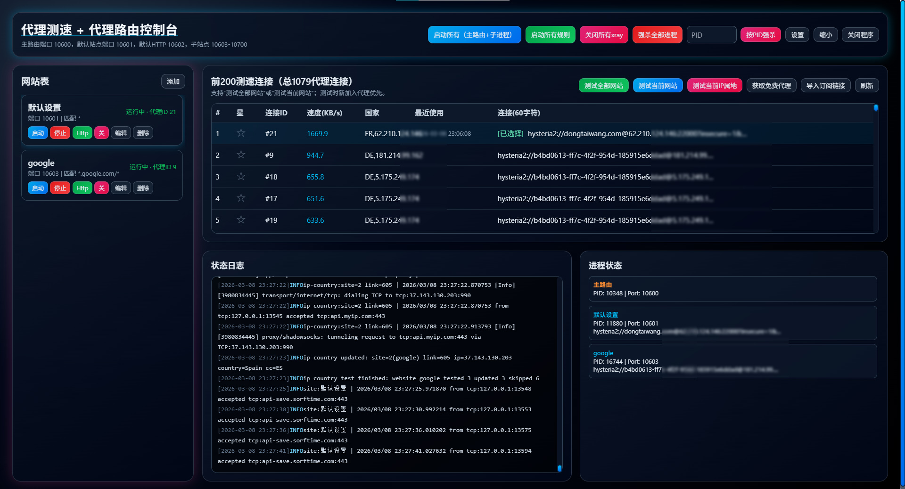

# Daxionglink GUI

本项目用于**免费获取并筛选代理连接**：支持一键获取 **1000** 个免费代理，也支持**自定义输入链接 / 自定义订阅 URL**。通过**多代理路由**与测速结果，`10600` 主入口可自动路由到当前更快的子路由端口（如 `10601`、`10603` 等），实现更高速、更稳定的网络连接；并支持网站测速、下载文件测速等方式。

## 功能概览

- 免费代理导入（当前版本远程导入默认 1000 条免费）
- 自定义订阅 URL 导入
- 多代理路由（主入口 `10600`，子路由 `10601` + `10603-10700`）
- 自动选择更优连接（基于测速结果）
- 下载文件测速（`download_url`）
- IP 属地测试与国家回填
- 单 EXE 桌面程序（双击启动）

## 快速开始

### 1. 准备文件

运行目录至少需要：

- `daxionglink.exe`
- `xray.exe`
- `GeoLite2-City.mmdb` / `GeoLite2-City-l.mmdb` / `geoip.dat` / `geosite.dat`

### 2. 启动

直接双击 `daxionglink.exe` 即可。

### 3. 使用流程

1. 在界面点击“获取免费代理”或“导入订阅链接”
2. 执行“测试当前网站”或“测试全部网站”
3. 启动连接后，将客户端代理指向 `127.0.0.1:10600`
4. 程序会按规则和测速结果自动路由到更优链路

## 端口说明

- `10600`：主路由入口（推荐统一使用）
- `10601`：默认网站路由端口
- `10603-10700`：其它网站路由端口
- `10602`：默认 HTTP 代理端口（由默认站点派生）

## 当前版本限制

- 免费代理远程导入：最多前 1000 条
- 网站路由表：最多 3 个

## Advanced / Pro

如果需要高级版本，或者定制版本可以email联系。

If you need more advanced features, check out the Pro version.

⭐ Pro version:

- Support importing up to 5000 free proxy links
- Multi-link routing
- High-concurrency xray speed testing

Pro URL:

- <https://github.com/Ilikeproton/free-v2ray-ssr-trojan-clash-nodes>

## Contact

